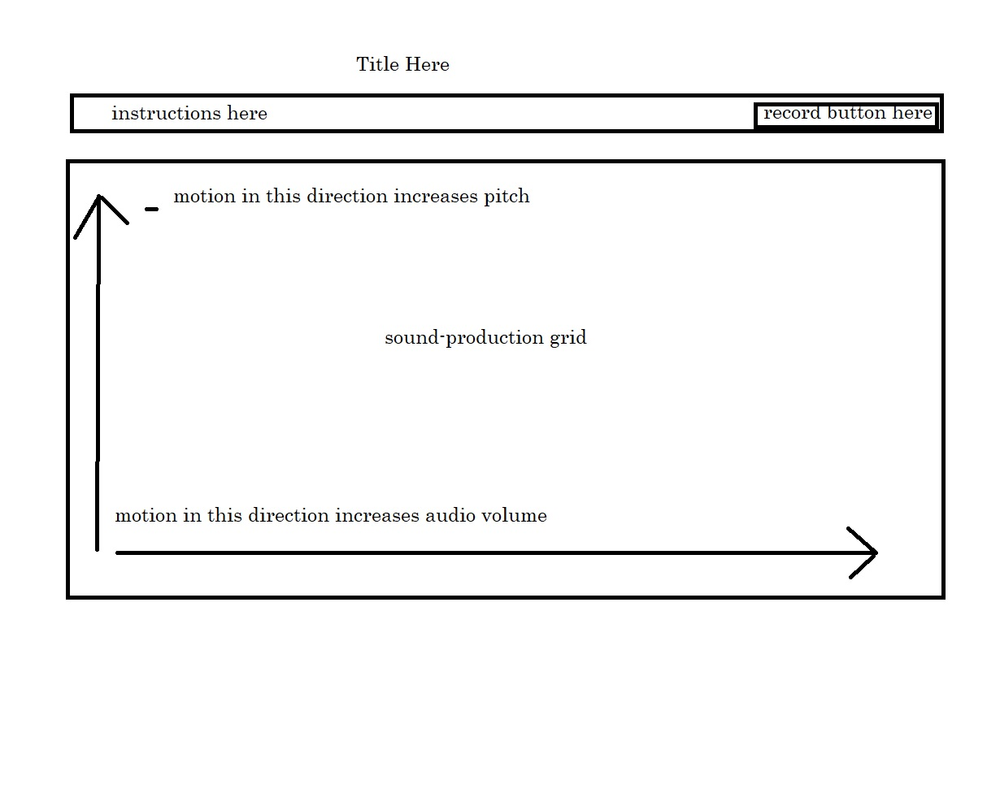

# Blake DeGraw's P4 Pitch

Working title: **Pitch-Glider**

## **New tech used:** 

**MVP:** javascript functionality to produce and manipulate sine waves. 

**Stretch:** javascript functionality to record/loop the sine waves. 

**Double-stretch:** javascript functionality to use a laptop's gyroscope to manipulate the sine waves.

***

A *very* cursory google search has revealed to me that the above-mentioned functionalities are possible in javascript, though I don't really understand how at this point. I plan on watching tutorials, reading tutorials, and watching/reading more tutorials in order to learn how to do this.

My goal for this project is to create a single-page app that allows the user to produce a sine wave by touching the screen of their phone (or clicking on the screen of their computer), and manipulating the pitch and intensity of the sine wave by dragging their finger/cursor across the X and Y planes on the screen. If stretch goals wind up being possible, I'd also like the use to be able to record their output and loop playback of the recorded audio while they continue to produce and manipulate sound.

The intended users for this app are the members of my community orchestra. If it works, I'd like to stage a performance in which I provide the members of the orchestra with written sheet music that they must attempt to play using the app. In such an event, I'd also like the audience members to be able to join in, provided they have smart phones.

The biggest roadblock I anticipate is that the manipulation of pitch will not be as smooth as I'd like. The record function might also be problematic, as I'm unsure how I'd be able to exclude external sounds being captured.

## Projected Work Flow

**March 11:** research and implement sine wave production

**March 12-13:** research and implement sine wave manipulation

**March 14-15:** link sine wave manipulation to cursor location

**March 16:** research recording/playback functionality

**March 17:** streamline UX design. 

If I miraculously wind up ahead of schedule, I plan on using that time to link sound manipulation to device's gyroscope.

